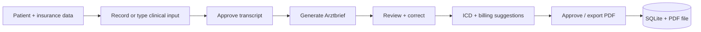

# App overview — MedLocal AI

**Audience:** Developers and stakeholders who want a plain-language picture of the product.  
**Last updated:** 2026-05-26

---

## What is MedLocal AI?

MedLocal AI is a **local-first** assistant for **German medical practices**. It helps physicians draft a formal **Arztbrief** (medical letter for insurers) from:

- **Voice dictation** (transcribed locally with Whisper), and/or  
- **Typed clinical notes**

All processing runs on the machine: **no cloud API is required** for transcription or text generation (Ollama for the LLM). That supports privacy goals (e.g. DSGVO-oriented deployments), though production use with real patient data still requires legal and technical safeguards.

**Important:** The physician must review, correct, approve, and sign any report. The app is a draft assistant, not a medical decision system.

---

## Who is it for?

- German practices (GKV, PKV, or Selbstzahler workflows)
- Demo and PoC use with **synthetic data** unless the deployment is approved for real patient data

---

## Main features

### 1. Patient and practice sidebar

Capture patient name, date of birth, address, treating physician, visit date, and insurance details (GKV or PKV/Selbstzahler with common **Krankenkasse** / insurer lists).

### 2. Clinical input workflow

- **Record audio** → local transcription → **Generated Transcript** (Transkript)
- Edit and **approve transcript** before generation
- **Additional clinical notes** (zusätzliche klinische Notizen) — optional; can drive text-only generation

### 3. Report generation (Arztbrief)

- Choose **Fachrichtung** (specialty) and **Tonfall** (tone: short, detailed, patient-friendly)
- **Generate** runs:
  - Local **ICD-10-GM** suggestions (mock dataset)
  - **Billing optimizer** (EBM for GKV, GOÄ for PKV/Selbstzahler — mock codes)
  - **Ollama** extracts structured clinical JSON from notes
  - Pipeline builds an **insurance-ready** German report (sections, validation, sanitization)

### 4. Review and output

- View and **correct** the generated report in the UI
- **Validation** checks (length, placeholders, required patient fields, etc.)
- **Approve** → save to SQLite (`data/medlocal.db`) + PDF on disk (`exports/reports/`)
- **Export PDF** for download without full approval flow
- **Time saved** estimate (manual documentation time vs. measured AI workflow)

### 5. Language

UI switches between **Deutsch** and **English** (labels, disclaimers, billing text). Generated Arztbrief content is intended for German insurer submission in German mode.

### 6. System health

Sidebar/panel indicators for local services (e.g. Ollama availability) so the user knows if generation may fail.

---

## Typical user flow



1. Fill patient sidebar.  
2. Dictate or type; approve transcript if using audio.  
3. Click **Arztbrief generieren**.  
4. Review report, ICD-10-GM and billing panels.  
5. Correct text if needed.  
6. Approve or export PDF.

---

## What is mocked vs. real?

| Area | Current implementation |
|------|-------------------------|
| Transcription | Real (local Whisper) |
| LLM | Real (local Ollama, default small model) |
| ICD-10-GM | **Mock** JSON search (`data/icd10gm/`) |
| Billing codes | **Mock** JSON (`data/billing/`) |
| Storage | Real SQLite + PDF files locally |

---

## Running the app

See root [README.md](../README.md): Python venv, `requirements.txt`, Ollama, then:

```bash
streamlit run app.py
```

---

## Related docs

- Technical layout: [ARCHITECTURE.md](ARCHITECTURE.md)
- What to do next: [NEXT_STEPS.md](NEXT_STEPS.md)
- Setup checklist: [README.md](../README.md) (manual tests)
