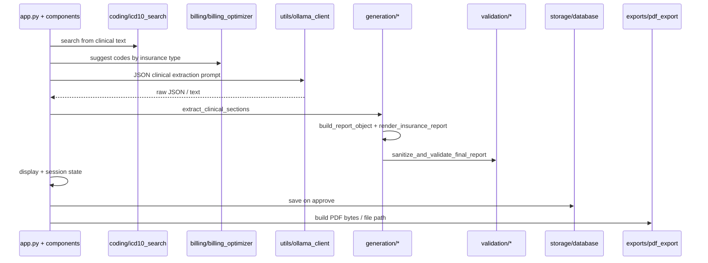

# Architecture — MedLocal AI

**Last updated:** 2026-05-26

Technical map of the codebase. For product language, see [APP_OVERVIEW.md](APP_OVERVIEW.md).

---

## Top-level layout

```
MedLocal-AI/
├── app.py                 # Streamlit entry: layout, session state, generation orchestration
├── i18n.py                # UI strings (de / en)
├── requirements.txt
├── components/            # Streamlit UI panels
├── generation/            # Report pipeline (extract → schema → render)
├── billing/               # EBM / GOÄ suggestion logic (mock data)
├── coding/                # ICD-10-GM search (mock data)
├── validation/            # Input + report validation, final guard
├── exports/               # PDF generation
├── storage/               # SQLite persistence
├── templates/             # Prompt templates (partially superseded — see NEXT_STEPS)
├── theme/                 # CSS-in-Python theming
├── utils/                 # Ollama, Whisper, hashing, time savings, text cleaning
├── state/                 # Session state reset keys
├── scripts/               # Offline validation scripts
├── data/                  # Mock JSON + local DB (DB gitignored)
└── docs/                  # Project documentation
```

---

## Request / generation flow



### Key modules

| Module | Role |
|--------|------|
| `components/input_panel.py` | Sidebar patient form, mic recorder, transcript workflow, generate button |
| `components/output_panel.py` | Report display, correction, approve/export actions |
| `components/code_suggestions.py` | ICD and billing UI panels |
| `components/progress_indicator.py` | Generation progress UX |
| `components/system_health.py` | Ollama / environment status |
| `generation/clinical_extractor.py` | Parse LLM JSON or fallback regex extraction |
| `generation/report_schema.py` | Structured report object |
| `generation/report_renderer.py` | Markdown/text Arztbrief from schema |
| `validation/final_report_guard.py` | Strip artifacts, placeholders, duplicate headings |
| `validation/report_validator.py` | Quality checks for display |
| `utils/whisper_client.py` | Local audio → text |
| `utils/ollama_client.py` | Local LLM HTTP API |
| `storage/database.py` | `approved_reports` table in `data/medlocal.db` |

---

## Session state

Streamlit `st.session_state` holds transcript workflow, generated report hashes, ICD/billing results, timing for “time saved”, and PDF export buffers. `state/reset.py` defines keys cleared when starting a new generation (`DERIVED_GENERATION_KEYS`).

---

## Data files

| Path | Purpose | In git? |
|------|---------|---------|
| `data/icd10gm/icd10gm_mock.json` | ICD search corpus | Yes (mock) |
| `data/billing/billing_codes_mock.json` | Billing suggestions | Yes (mock) |
| `data/medlocal.db` | Approved reports | **No** (gitignored) |
| `exports/reports/*.pdf` | Exported letters | **No** (gitignored) |

---

## Internationalization

`i18n.py` exposes `t(key, lang)` and `lang_code()` for UI. Report body language is driven by generation/render paths (`language` parameter, typically `de`).

---

## Known structural debt

Documented in [NEXT_STEPS.md](NEXT_STEPS.md):

- Unused imports and orphan modules from PoC iteration
- Duplicate sanitization (`report_cleaning` vs `final_report_guard`)
- Large inline prompt in `app.py` vs `templates/prompts.py`
- `theme/theme.py` embeds ~400 lines of CSS

---

## Validation outside the app

```bash
python scripts/validate_demo_reports.py
python scripts/validate_time_savings.py
```

These scripts import project modules via `sys.path` and run deterministic checks.
